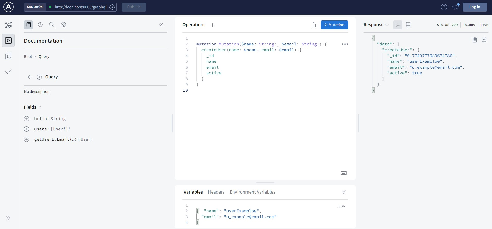

<div align="center">
  
</div>

# <div align="center"> GraphQL Subscriptions </div>

#### <div align="right">- Projeto Finalizado🟢 <div>

### <div align="center"> Aplicação em javascript, abordando conceitos sobre: </div>

#### - GraphQL
#### - Apollo Server Express
#### - Query
#### - Mutations
#### - Subscriptions

## <div align="center"> Sumário </div>
<!--ts-->
   - [Requisitos](#<div-align="center">Requisitos</div>)
   - [Tecnologias utilizadas](#<div-align="center">Tecnologias-utilizadas</div>)

<!--te-->
## <div align="center">Requisitos</div>
Para executar a aplicação é necessário instalar algumas ferramentas tais como um editor de códigos para realizar compilação dos mesmos. Nesse projeto foi utilizado o [Visual Studio Code](https://code.visualstudio.com/), [NodeJS](https://nodejs.org/en/) para compilação do código, [Git Bash](https://gitforwindows.org/) para baixar o repositório e baixar todas as dependências necessárias.

```bash
# Baixe o repositório.
$ git clone https://github.com/Ricnaga/GraphQl-Subscriptions.git
# Acesse a pasta do projeto.
$ cd GraphQl-Subscriptions

# Agora que baixou e acessou o repositório, vamos começar a instalação das dependências.
$ yarn ( caso não utilize o yarn execute apenas npm -i)

# Depois de instalado todas as dependências, abra a aplicação via vscode
$ code .

# Agore execute a aplicação.
$ yarn start (caso não utilize o yarn: npm run start)

# A aplicação iniciará na porta 8000
# No navegador digite: http://localhost:8000/graphql

# Na pasta examples estão todos os códigos disponíveis para executar os serviços
```

##  <div align="center">Tecnologias utilizadas</div>
- [GraphQL](https://graphql.org/)
- [Apollo Server](https://www.apollographql.com/docs/apollo-server/)


<div align="center">Desenvolvedores envolvidos:

<a href="https://www.linkedin.com/in/ricardo-nagatomy"></a>
 <a href="https://www.linkedin.com/in/kelvin-teixeira-8707b41a8/"></a>

Gostou? tem alguma sugestão de melhoria? por favor, entre em contato e ja aproveita e me adiciona.<br>

#
<div align="center">  </div>